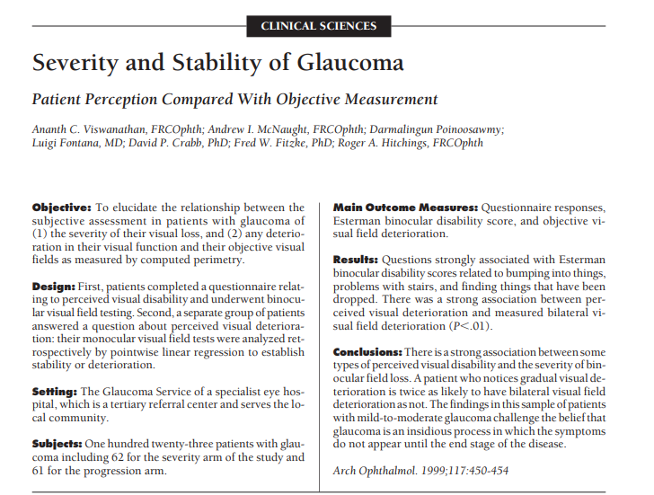

<h1 align = "center">Abstract   Exercise</h1>

Name : GE Wei       Account : 12032291

## Objective:

To elucidate the relationship between the  subjective assessment in patients with glaucoma of  (1) the severity of their visual loss, and (2) any deterioration in their visual function and their objective visual  fields as measured by computed perimetry.  

## Design:

First, patients completed a questionnaire relating to perceived visual disability and underwent binocular visual field testing. Second, a separate group of patients  answered a question about perceived visual deterioration: their monocular visual field tests were analyzed retrospectively by pointwise linear regression to establish stability or deterioration.

## Setting:

The Glaucoma Service of a specialist eye hospital, which is a tertiary referral center and serves the local community.  

## Subjects:

One hundred twenty-three patients with glaucoma including 62 for the severity arm of the study and  61 for the progression arm.  

## Main Outcome Measures:

Questionnaire responses,  Esterman binocular disability score, and objective visual field deterioration.  

## Results:

Questions strongly associated with Esterman  binocular disability scores related to bumping into things,  problems with stairs, and finding things that have been  dropped. There was a strong association between perceived visual deterioration and measured bilateral visual field deterioration (P<.01).  

## Conclusions:

There is a strong association between some  types of perceived visual disability and the severity of binocular field loss. A patient who notices gradual visual de-  terioration is twice as likely to have bilateral visual field  deterioration as not. The findings in this sample of patients  withmild-to-moderate glaucoma challenge the belief that  glaucoma is an insidious process in which the symptoms  do not appear until the end stage of the disease.  

