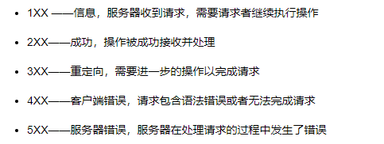

# 计算机网络面试问题准备

## 1. TCP与UDP的比较

- TCP：传输控制协议：提供面向连接的，可靠的数据传输服务；
- UDP：用户数据报协议：提供无连接的、尽最大努力的数据传输服务（不保证数据传输的可靠性）

### 比较：

- TCP向上层提供面向连接的可靠服务，UDP向上层提供无连接不可靠服务；
- TCP是把数据流分割成适当长度的报文段之后进行传输，其传输单位为TCP报文段，而UDP把网络数据压缩成数据包的形式进行传输，其传输单位为用户数据包；
- TCP是一对一传输，UDP支持一对一、一对多、多对一和多对多的交互通信；

**TCP如何保证传输的可靠性**：超时重传、校验和、拥塞控制

**TCP的拥塞控制**：慢启动-拥塞避免-快速恢复

## 2. 三次握手与四次挥手

### 三次握手：

目的：确认客户端与服务端彼此接收、发送信息的能力是否正常

第一次握手：客户端将SYN置为1，表示希望与服务端建立连接，并产生一个随机序列，发送给服务端，服务端收到SYN=1，知道了客户端想要建立连接（此时服务端能够确定客户端发送消息的能力）；

第二次握手：服务端再将SYN置为1，将接收到的客户端随机序列加一（这个序列命名为ACK），服务端自己也产生一个随机序列，发送给客户端，客户端收到服务端发送的报文，会检查ACK是否为自己产生的随机序列加一，（如果是，则能够确定服务端接收消息、发送消息的能力，==但此时服务端无法确定客户端接收消息的能力，为什么不是两次握手的原因==）；

第三次握手：客户端会将服务端产生的随机序列加一发送给服务端（服务端能够借此判断客户端接收消息的能力）

为什么不是四次握手？以上三次握手客户端与服务端已经能够确认彼此接收、发送消息的能力，不需要再多一次.

### 四次挥手：

目的：断开客户端与服务端的TCP连接

第一次挥手：假设客户端向服务端发起断开请求，客户端会向服务端发送请求断开连接的报文

第二次挥手：当服务端接收到客户端的断开请求，服务端会告知上层应用进程来自客户端的连接即将关闭（此时客户端已经没有向服务端发送数据，但服务端向客户端发送数据，客户端仍能接收）

第三次挥手：客户端收到服务端的确认报文后，服务端会再向客户端发送自己的终止报文段，表示服务端向客户端发送断开连接请求（此时服务端进入关闭等待状态）

第四次挥手：客户端收到服务端的断开请求后，必须发出确认报文，进入定时等待状态，此时客户端的TCP连接还没有释放，必须经过2*MSL（最长报文段寿命）时间后才会关闭连接，服务端接收到客户端的确认报文后才会关闭连接。

**为什么是四次挥手而不是三次或者五次？**

第二次挥手和第三次挥手都是服务端向客户端发送报文，第二次挥手是服务端通知客户端服务端已收到客户端的断开连接请求，此时客户端已没有数据向服务端发送，但不代表服务端也没有数据向客户端发送（服务端要把剩余没有发送完毕的报文发送完毕再断开连接）。第三次挥手是服务端数据全部发送完毕，向客户端发送断开连接请求。如果是三次挥手，即把服务端向客户端发送报文的第二次挥手和第三次挥手合并为一次，会造成服务端向客户端发送回执后又立即发送断开连接请求，会造成服务端有数据没有全部发送至客户端，因此必须将第二次挥手与第三次挥手分开。

五次挥手则没有必要。

**在第四次挥手时，为什么客户端需要进入定时等待状态？**

1. 第四次挥手客户端向服务端发送回执后，有可能这个回执报文服务端并没有接收到，此时服务端会再次向客户端发送请求断开连接报文，如果客户端没有进入定时等待状态而提前关闭连接，客户端就会收不到服务端再次发送的请求断开连接报文，导致服务端无法进入关闭状态；
2. 等待一段时间是为了让此次连接产生的所有报文从网络中消失，使得下一个新的连接不会出现旧的连接请求报文。

## 3. OSI的七层协议、TCP五层协议

### OSI:

- 应用层：为应用程序提供服务
- 表示层：数据格式转换、压缩、加密
- 会话层：建立、断开和维护通信链接
- 传输层：为上层协议提供端到端可靠传输
- 网络层：寻址和路由
- 数据链路层：定义通过通信媒介互联的设备之间传输的规范
- 物理层：利用物理传输介质，为数据链路层提供物理连接

### TCP:

应用层、传输层、网络层、数据链路层、物理层

**应用层协议种类**：

1. DNS：域名解析协议：把人们使用的机器名转换为IP地址
2. FTP：文件传输协议
3. HTTP：超文本传输协议：是面向事务的应用层协议，使用面向连接的TCP作为运输层协议，保证了数据的可靠传输
4. telnet远程终端协议：
5. SMTP电子邮件协议：
6. SNMP简单网络管理协议：

**DNS解析的具体流程**：

## 4. HTTP相关

### 4.1 什么是HTTP协议，HTTP与HTTPS的区别

HTTP协议-超文本传输协议，客户端与服务端相互通信时将信息以HTTP报文的形式传播

HTTPS是在HTTP的基础上对其加密、认证和完整性保护

HTTP协议的缺点：1）通信使用明文，内容可能被窃听；2）通信双方的身份无法得到认证；3）无法验证报文的完整性；

HTTPS的改进：1）通过协议将报文内容进行加密；2）通过值得信任的第三方机构颁布证书，确认通信双方彼此身份；3）可以通过MD5等散列码对通信内容进行校验

常用默认端口号：HTTP：80、8080等；HTTPS：443

### 4.2 常见的HTTP动词

- get：从服务器获取资源
- post：在服务器新建资源
- put：在服务器更新资源
- delete：在服务器删除资源

put与post的区别：post在发送请求时，服务器每次都会新建一个文件，而put发送请求时服务器是更新文件而不是创建文件

### 4.3 常见的HTTP返回码

- 204：请求被受理，但没有资源可以返回
- 400：请求报文语法有误，服务器无法识别
- 401：请求需要认证
- 403：请求的对应资源禁止被访问
- 404：服务器无法找到对应资源

